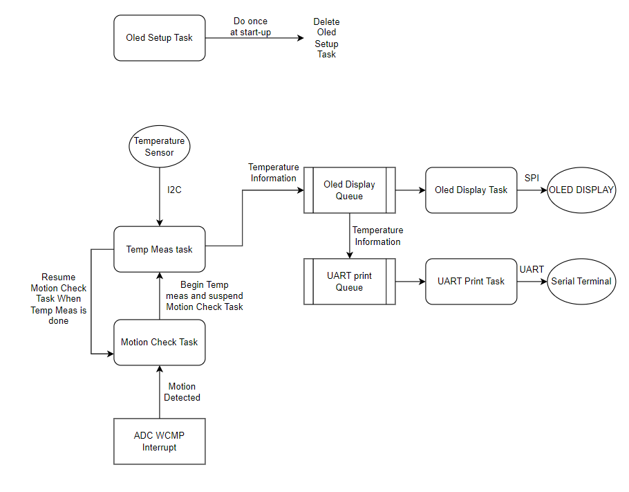
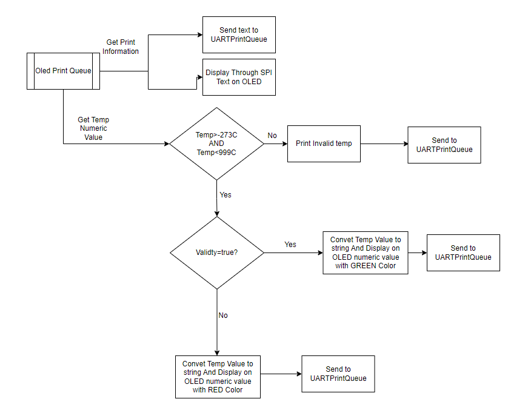
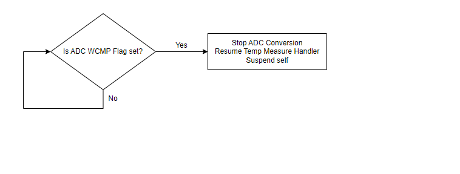
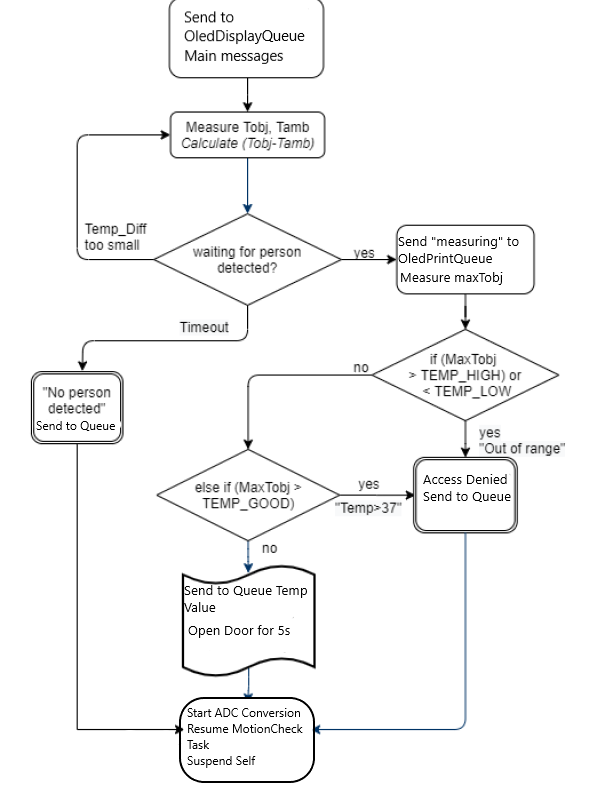
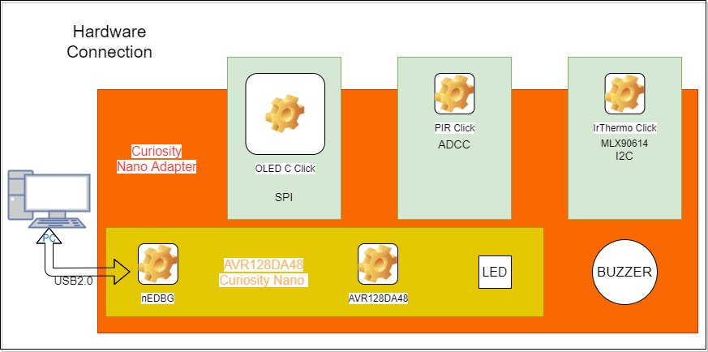
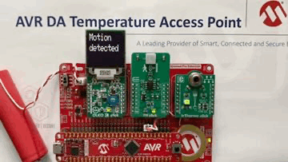

 <article class="markdown-body entry-content p-3 p-md-6" itemprop="This needs to locked down and 'never' changed">

# Temperature Access Point using AVR® DA microcontroller and FreeRTOS

This repository contains a FreeRTOS implementation of a temperature access point with motion detection. It has contactless temperature ir auto-scanning using the AVR® DA microcontroller from Microchip.

## Related Documentation
More details and code examples on the AVR128DA48 can be found at the following links:
- [TB3245 - Using 12-Bit ADC for Conversions, Accumulation, and Triggering Events](http://www.microchip.com/wwwappnotes/appnotes.aspx?appnote=en1001530)
- [AVR128DA48 Product Page](https://www.microchip.com/wwwproducts/en/AVR128DA48?utm_source=GitHub&utm_medium=TextLink&utm_campaign=MCU8_MMTCha_AVR-DA&utm_content=freertos-temp-access-point&utm_bu=MCU08)
- [AVR128DA48 Code Examples on GitHub](https://github.com/microchip-pic-avr-examples?q=avr128da48)
- [AVR128DA48 Project Examples in START](https://start.atmel.com/#examples/AVR128DA48CuriosityNano)
- [FreeRTOS Documentation](https://www.freertos.org/index.html)

## Software Used
- [MPLAB® X IDE 6.15](https://www.microchip.com/en-us/tools-resources/develop/mplab-x-ide?utm_source=GitHub&utm_medium=TextLink&utm_campaign=MCU8_MMTCha_AVR-DA&utm_content=freertos-temp-access-point&utm_bu=MCU08) or newer
- [MPLAB XC8 2.45](https://www.microchip.com/en-us/tools-resources/develop/mplab-xc-compilers?utm_source=GitHub&utm_medium=TextLink&utm_campaign=MCU8_MMTCha_AVR-DA&utm_content=freertos-temp-access-point&utm_bu=MCU08) or newer
- [MPLAB Code Configurator (MCC) 5.22](https://www.microchip.com/en-us/tools-resources/configure/mplab-code-configurator?utm_source=GitHub&utm_medium=TextLink&utm_campaign=MCU8_MMTCha_AVR-DA&utm_content=freertos-temp-access-point&utm_bu=MCU08) or newer
- AVR-Dx_DFP 2.2.159 (Install from MPLAB X IDE -> Tools -> Packs )
- FreeRTOS MCC Library v1.0.3

## Hardware Used
- AVR128DA48 Curiosity Nano [(DM164151)](https://www.microchip.com/en-us/development-tool/dm164151?utm_source=GitHub&utm_medium=TextLink&utm_campaign=MCU8_MMTCha_AVR-DA&utm_content=freertos-temp-access-point&utm_bu=MCU08)
- Curiosity Nano Base for Click Boards [(AC164162)](https://www.microchip.com/en-us/development-tool/AC164162?utm_source=GitHub&utm_medium=TextLink&utm_campaign=MCU8_MMTCha_AVR-DA&utm_content=freertos-temp-access-point&utm_bu=MCU08)
- OLED C click board [(MIKROE-1585)](https://www.mikroe.com/oled-c-click)
- PIR click board [(MIKROE-3339)](https://www.mikroe.com/pir-click)
- IrThermo click 3.3V board [(MIKROE-1361)](https://www.mikroe.com/irthermo-33v-click)

## Setup

The AVR128DA48 Curiosity Nano Development Board[ (DM164151)](https://www.microchip.com/en-us/development-tool/dm164151?utm_source=GitHub&utm_medium=TextLink&utm_campaign=MCU8_MMTCha_AVR-DA&utm_content=freertos-temp-access-point&utm_bu=MCU08) is used as development platform, inserted into the Curiosity Nano Base for Click Boards [(AC164162)](https://www.microchip.com/en-us/development-tool/AC164162?utm_source=GitHub&utm_medium=TextLink&utm_campaign=MCU8_MMTCha_AVR-DA&utm_content=freertos-temp-access-point&utm_bu=MCU08).

  - **The Hardware Configuration** uses an OLED C click, PIR click, and IrThermo click, inserted into mikroBUS slots of the Curiosity Nano Adapter along side the AVR128DA48 Curiosity Nano.
 

 Below is the pin configuration for the project:

|Pin           | Configuration          |
| :----------: | :----------------:     |
|PD4 (AIN4)    | Analog Input ADC0 (PIR)|
|PC2 (SDA)     | Digital TWI0 i2c       |
|PC3 (SCL)     | Digital TWI0 i2c       |
|PA4 (MOSI)    | Digital Output SPI     |
|PA5 (MISO)    | Digital Input SPI      |
|PA6 (SCK)     | Digital Output SPI     |
|PA7 (nCS)     | Digital Output OLED    |
|PD0 (DC)      | Digital Output OLED    |
|PD3 (RW)      | Digital Output OLED    |
|PD6 (EN)      | Digital Output OLED    |
|PD7 (RST)     | Digital Output OLED    |
|PC6 (LED0)    | Digital Output DOOR    |

## Operation

### Project Description
This project describes the usage of the AVR DA microcontroller as the heart of the Temperature Auto-Scanning Door Access.
The purpose is to detect a person using a PIR sensor and then measure its temperature using an IR contactless thermo-scanner.  
The ADC peripheral is used to read the PIR Click board, and trigger from sleep the CPU, only if the ADC value is outside the Window Comparator Threshold. 
Then, the OLED C Click board is used to display the information to the user. The project was ported onto a real time operating system, FreeRTOS. 
The flow diagram of different FreeRTOS Tasks are presented here:
 
### FreeRTOS Porting
In order to port to FreeRTOS we have to slice the source code into different tasks/threads, each with different priority.
Thus we have:
- The OLED Setup task, ran only once at start-up in order to configure the OLED to the correct settings using SPI.
- The OLED Display Task, which its only purpose is to wait for some information to appear inside the OLED Print Queue and display it on the OLED Screen.
   
- The UART Print Task, which the same as before, it waits for the UART Print Queue to have information inside it and will print that information on the serial terminal.
- The Motion Check Task, used to routinely check if the ADC Window Comparator Interrupt has gone off, in which case it will start up the Temperature Measure task.
    
- The Temperature Measure Task, the primary function of this project, will firstly compare the temperature difference (Tobject-Tambient) with a predefined value in order to be sure that a human is in front of the sensor and if it is above it , it will start to actually measure the user temperature. After that, the door "actuator" (the PC6 LED) will be opened or closed, based on the read temperature value. In parallel, information is being sent to both queues.
   

#### The FreeRTOS code is inside mcc_generated_files/freertos/freertos_interface.c

### Demo Operation
1. Connect the board to a PC/Laptop/Mac with a micro-USB cable, like in the diagram below:
 
2. Open MPLAB X and load the project avr128da48-temp-ir-auto-scanning-freertos.X
3. Clean and Build Project, then Make and Program the AVR128DA48 Curiosity Nano.
4. After programming, the OLED screen should light up with the message: "Motion detected" when motion is detected.
5. Follow the steps provided by the display to measure the contactless temperature, as in the animation below:
     
6. Watch the full demo of this application in the video link, below:
   - [AVR® DA Temperature Access Point Demo](https://youtu.be/6xuM3KN8ohE)
   - 

## Summary
This example provides a method for using the The AVR® DA family of microcontrollers for a Real Time Operating System project, such as a temperature access point with auto-scanning and low power functions built on the FreeRTOS Library provided by MCC.
AVR® DA will detect moving persons nearby and invite them to measure their contactless temperature, showing the result on the OLED display.
The hardware setup can be powered by a single lithium battery and because of the low power consumption, it will last for many hours.
